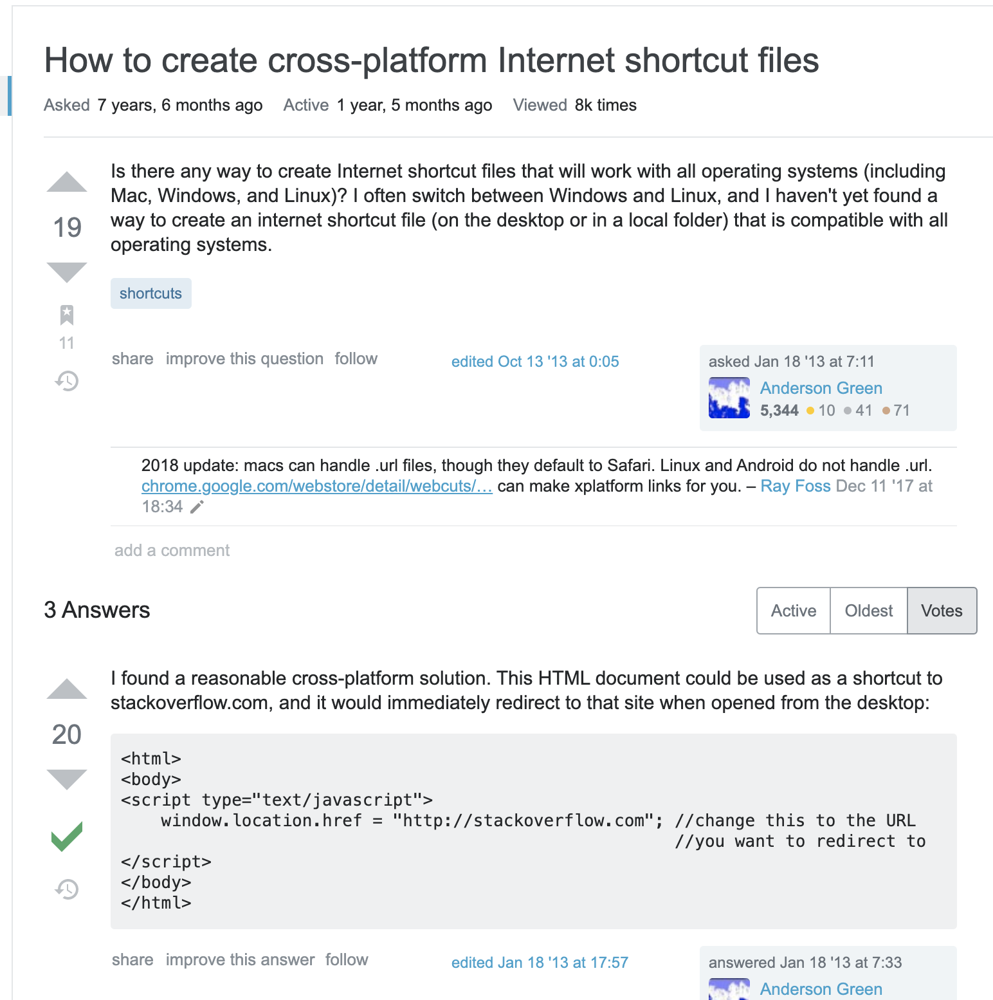

A simple implementation in Python of this:

Instructions:
1. Clone repo.
2. Place desired .webloc file in same directory as script.
3. Call script from command line with webloc filename as argument.
4. Find similarly-named html result at same place.